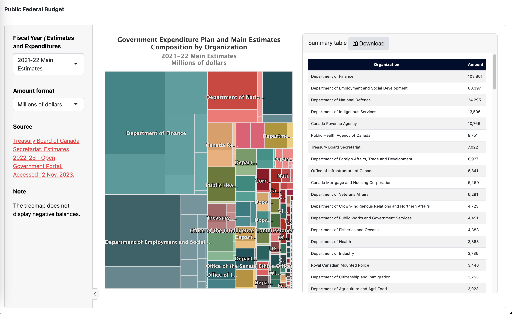

# Government Expenditure Shiny App

## Description

The Government Expenditure Shiny App provides a user-friendly interface to explore and understand the distribution of government expenditures across various organizations and descriptions.

Users can interact with the treemap to navigate through different levels of the budget hierarchy and the connected table ensures that detailed information is readily available. The dynamic data processing feature enhances the app's versatility, allowing users to customize their view of the data.

## Acknowledgment

The data used in this project is sourced from the Treasury Board of Canada Secretariat's "Estimates 2022-23," which is available on the [Open Government Portal](https://open.canada.ca/data/en/dataset/a81099a5-f73e-4c92-ba14-0603a00d40df).

## Shiny App Link

You can access the running instance of the Shiny app [here](https://javier-mtz-rd.shinyapps.io/PublicFedBudg/).

## Assignment Choice

This project was undertaken as part of **Option B: Create your own Shiny app with three features and deploy it.**

## Features

1.  **Treemap Visualization:** The app has a treemap visualization to represent the Government Expenditure Plan and Main Estimates Composition by Organization and Description. This allows users to explore the budget allocation at different levels.

2.  **Downloadable Table:** The treemap is complemented by a downloadable table that dynamically updates based on user interactions. Clicking on different segments of the treemap triggers updates in the table, providing users with detailed information about the selected organization and description. This feature facilitates data sharing, allowing users to utilize the information in other contexts.

3.  **Dynamic Data Processing:** The app includes functionality to process the dataset dynamically based on user input. Users can choose the fiscal year and format in which they want to view the expenditure amounts (e.g., Bills, millions, thousands, or dollars).